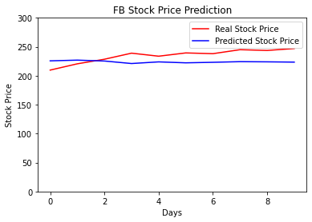

# LSTM-for-predicting-facebook-open-stock-price
A LSTM-based approach for predicting Facebook's open stock price considering the previous months.

## Two weeks (working days) prediction considering the previous 90 days of the open price

## Two months (working days) prediction considering the previous 120 days of open price
### Libraries 
Sklearn, Pandas, Numpy, Matplotlib, Keras.

### TO DO:
- Download the stock price from the internet
- Add the sheet to yout python environment
- Chose the time window to be analyzed for the prediction 
- Chose the time window to be predicted
- Train your code 
- Make the prediction
- Plot the results 

