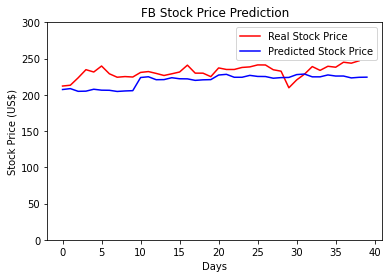

# LSTM-for-predicting-facebook-open-stock-price
A LSTM-based approach for predicting Facebook's open stock price considering the previous months.

## Two weeks (working days) prediction 
Prediction made considering the previous 90 days of Facebook's stock open price

## Two months (working days) prediction
Prediction made considering the previous 90 days of Facebook's stock open price.
Every 90 days, a prediction of the next two weeks is done.

### Libraries 
Sklearn, Pandas, Numpy, Matplotlib, Keras.

### TO DO:
- Download the stock price from the internet
- Separate the stock price in train and test 
- Add the sheet to your python environment
- Chose the time window to be analyzed for the prediction 
- Chose the time window to be predicted
- Train your code 
- Make the prediction
- Plot the results 

# Acknowledgments 
Dataset from Macrotrends (https://www.macrotrends.net/stocks/charts/FB/facebook/stock-price-history)

